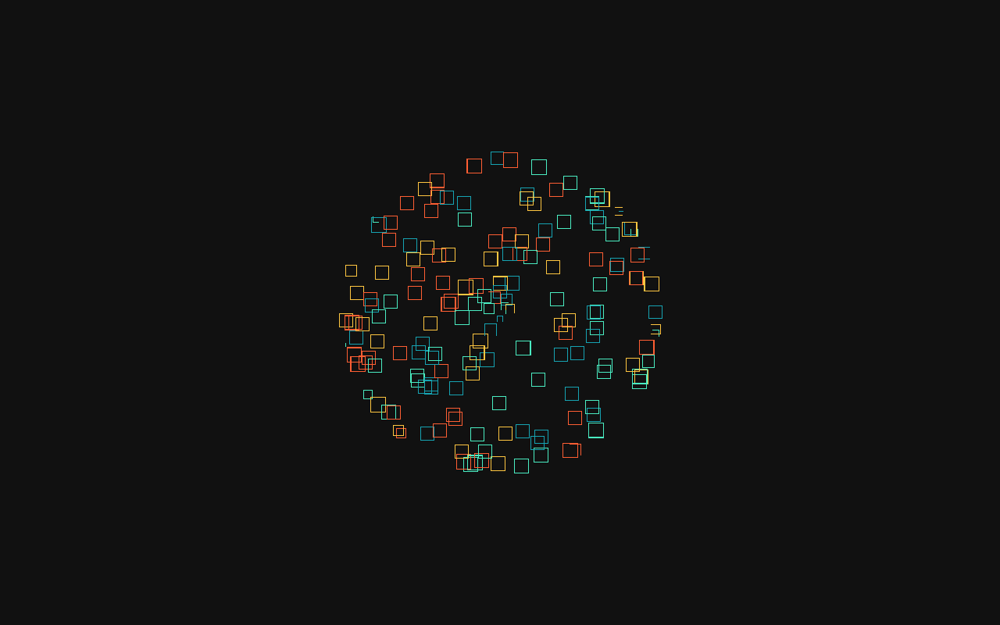

# Anime.js Preloading Particles

Particle preloading animation with Anime.js.



**Live demo:** [https://rogue-dev-studio.github.io/animejs-preloading-particles/](https://rogue-dev-studio.github.io/animejs-preloading-particles/)

## Highlights
- Preloader-style particles
- Static demo page

## Run
Open `index.html` locally (Live Server on port **5500**), or use the live demo above.

```bash
git clone https://github.com/rogue-dev-studio/animejs-preloading-particles.git
```

By [Aris Hadisopiyan](https://rogue-dev-studio.github.io/) / Rogue Dev Studio.

MIT
